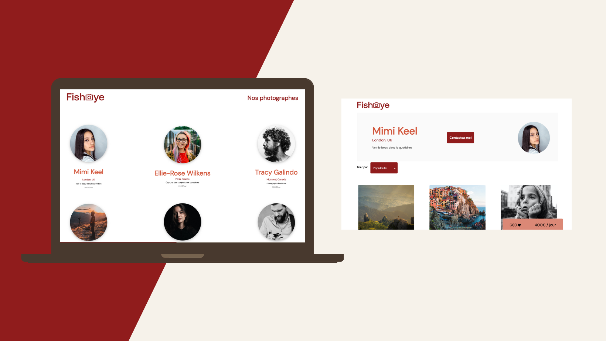

# FishEye Project

## Description
This is the 6th project of the OpenClassrooms Front-End Developer path. The goal was to create a website for a photographer named FishEye. The website is composed of a homepage, a page for each photographer and a contact page. The website is accessible.
You can navigate to each page with the keyboard (tab key). 

## Start Project
Nothing to install here, just open the `index.html` file.

## Technologies
* HTML5
* CSS3
* JavaScript

Using Visual Studio Code and the Live Server extension.